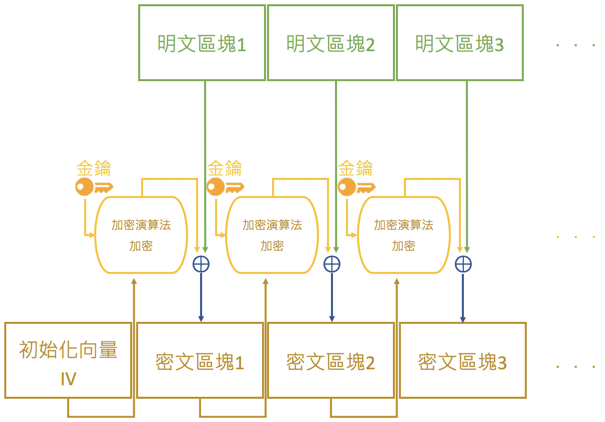
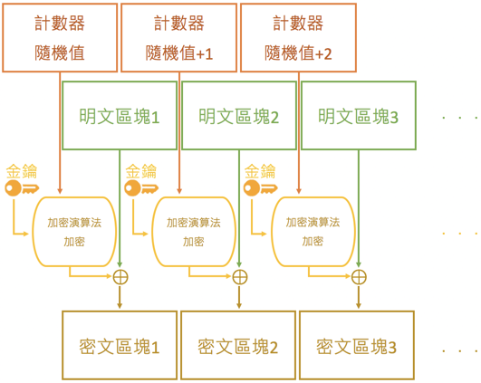

# 2021年新春隨筆 1：針對流加密的攻擊手段，兼談 Shadowsocks 與 vmess 的陳年舊事

其實在寫這篇文章前，我對密碼學也只瞭解到本文 0x02 處，所以這篇文章可以算是邊查邊學寫出來的，若有錯誤，還請指正。針對原始 Shadowsocks 與舊版 vmess 可能進行的選擇密文攻擊的偵測手段與針對原始 Shadowsocks 可能的重定向攻擊都曾掀起軒然大波（以及 breakwa11 事件）。在此我並非想挑事，只是希望在2020年的vmess事件之後，能有更多開發者用戶能重視並學習針對加密算法的攻擊，並能參與加密協定設計與實現代碼的審計，共同捍衛網際網路的自由與安全。新春之際，我對 Shadowsocks(R/RR)、ProjectV、Trojan、NaïveProxy、vnet-tunnel、gost、SoftetherVPN 等開放原始碼代理/隧道/VPN 項目的貢獻者們再次表示感謝並持以敬意，祝大家在新的一年裡武運昌隆、萬事順心。

## 0x01 邏輯互斥或（xor/ $\bigoplus$）

（如果對數學，資訊技術或是密碼學略知一二，應該已經很清楚xor了，可以跳過這節內容。不過看一看複習一下也沒什麼不好~~，以免等下一頭霧水~~）

對於長度相同對二進位數 a 與 b，令 $c = a \bigoplus b$。

當 $a[i] = b[i]$， $c[i] = 0$；當 $a[i] ≠ b[i]$， $c[i] = 1$。

舉個例子：

$111000110010 \bigoplus 101100111000 => 010100001010$

很顯然地，互斥或存在這樣的性質： $c = a \bigoplus b <=> a = b \bigoplus c <=> b = a \bigoplus c$

## 0x02 密文反饋（cfb/Cipher feedback） & 計數器模式（ctr/Counter）

cfb 是一種流加密方案。加密前，首先將明文按固定的塊大小割成多塊，生成初向量（IV/Initialization Vector，有時也寫作 salt），使用塊加密演算法將 IV 進行加密，再將加密後的 IV 與第一個明文塊做 xor，生成第一個密文塊。再塊加密第一個密文塊，與第二個明文塊做 xor，生成第二個密文塊。再塊加密第二個密文塊，與第三個明文塊做 xor，生成第三個密文塊。以此類推~~，無限套娃~~。



解密也很簡單，直接將加密的 IV 或加密的上一個密文塊與本密文塊按位互斥或，即可解密出本明文塊。（ $c = a \bigoplus b <=> a = b \bigoplus c <=> b = a \bigoplus c$）

很顯然，IV 以及加密用的演算法通常要求是對雙方已知的，否則加密的 IV 將未知，也就無法解密。最終與明文塊做 xor 的數字長度需要等於（小於則補 0）塊大小，否則密文塊將不定長，所以通常會保證加密後的 IV 長度正好等於塊大小（雖說再加工一下也並不是不可以，但是通常就是這麼做的。主要是因為 AES 等加密演算法加密前後長度不變，這樣就可以在 IV 生成中就控制加密後IV的長度）。

IV 不能固定。為什麼呢？IV 固定且加密演算法固定，則加密的 IV 亦固定，那便可以視為使用靜態密鑰透過 xor 加密。將加密的 IV 記為 $a$，將兩個明文塊分別記為 $x$， $y$，令 $ex = x \bigoplus a$， $ey = y \bigoplus a$。若攻擊者知道 $x$、 $ex$，又擷取到了 $ey$，就可以算得 $a$， $y = ey \bigoplus a = ey \bigoplus ex \bigoplus x$，從而輕易地解密 $y$。（簡單說，就是 xor 運算允許知二求一）在密碼學中，這樣的攻擊方式被稱作「已知明文攻擊（Known-plaintext attack）」。

ctr 也是一種流加密方案。加密前同樣將明文分塊、生成初向量，後將初向量與一個不常產生相同數字的非隨機函式根據計數器產生的定長數字相連，將連接後的數字進行塊加密，將加密結果與明文塊按位互斥或，產生密文塊。（下面這張圖沒有提到 IV，其實 IV 就是計數器隨機值）



可以發現，cfb 與 ctr 都有一個共同的特性：明文位與密文位一一對應，即修改某位二進位明文，只改變此位的密文。這其實是流加密的共性。當然這是有一定好處的：即使某塊密文有損壞，仍能解密出除此之外的大部分明文；以及按順序（在網際通訊中，順序一般由 TCP 保證）收到的密文字元均可以立即解密。

（限於篇幅~~，而且我也不想寫了~~，本文就只講目前仍使用較多的 cfb 和 ctr 方法，對於在 Shadowsocks 中沒有使用的 ecb、cbc、pcbc、ofb，已不被推薦使用的 rc 系和 chacha/salsa 系就暫時不做說明了）

## 0x03 選擇密文攻擊（Chosen-ciphertext attack） & 重定向攻擊（Redirect attack）

因為明文位與密文位一一對應（在 cfb 和 ctr 模式下均為直接對應），所以若已知某些位置明文的意義，便可以透過窮舉密文來窮舉明文，以達到某些攻擊者想達到的效果。這種攻擊方式即為「選擇密文攻擊」。

對於 cfb，令加密端為 C，解密端為 S，攻擊者為 A。若 A 已知明文區塊 $n$，截獲密文區塊 $n$，便可以 xor 得到透過塊加密的密文區塊 $n - 1$（或加密的 IV），記為 $p$。A 便可以構造自己想要的明文區塊 $x$，算出其對應的密文區塊 $y = x \bigoplus p$。 A 偽造 C，將密文區塊 $y$ 代替密文區塊 $n$ 發給 S。若 C 端與 S 端均未察覺這一動作，則 S 端解密得到的明文區塊 $n$ 將是攻擊者構造的明文區塊 $x$。由於改變了密文區塊 $n$，所以明文區塊 $n + 1$ 只能解密為亂數，但由於密文區塊 $n + 1$ 並沒有被改變，所以密文區塊 $n + 2$ 及接下來的所有密文區塊均能正常解密。

（如果沒看明白，我就再解釋一遍）

將下圖中明文塊稱作綠塊，密文塊稱作褐塊，加密塊稱作黃塊。箭頭方向均不變即加密流程，將指向 $\bigoplus$ 的綠色與藍色箭頭均上下反轉則為解密流程（如果無法理解這句話，請翻到上文再看一遍 cfb 的解密）。


攻擊者知道綠塊 1 和褐塊 1，就可以 xor 得到橙塊 1（ $c = a \bigoplus b <=> a = b \bigoplus c <=> b = a \bigoplus c$）。攻擊者就可以構造任意綠塊 $x$，與橙塊 1 xor 得到褐塊 $x$。攻擊者用褐塊 $x$ 來替換褐塊1，解密者便會正常解密得到綠塊 $x$。由於改變了褐塊 1，褐塊 2 的解密就會受影響，導致解密者無法得到正常的綠塊 2。但由於褐塊 2 沒有被修改，所以褐塊 3 可以被正常解密得綠塊 3。接下來的解密均將正常。

~~（如果還看不明白，我也懶得再解釋了）~~

所謂「重定向攻擊」在這篇文章中主要指針對代理/VPN 協定，中間人攻擊（MITM/Man-in-the-middle attack）的攻擊者透過某些方式使得伺服器端將解密的資料重定向發送到自己的伺服器，具體方案就請看~~下回分解~~ 0x06 的案例（說實話，我也沒看到其它比較好的重定向攻擊的案例了，估計也是我太孤陋寡聞了吧）。

## 0x04 針對 Shadowsocks 的選擇密文攻擊探測（感謝 [GitHub@breakwa11](https://github.com/breakwa11)）

Shadowsocks 在客戶端隨機生成 IV，客戶端將 IV 先發給伺服器。

在（原始）Shadowsocks 中，第一個封包為 IV+加密的 ATYP、DST.ADDR、DST.PORT ~~（具體意義請見 [RFC1928](https://www.ietf.org/rfc/rfc1928.txt)）~~（在這裡其實沒有必要知道它們是啥意思的。~~首先就算瞪著硬猜，估計也能猜個八九不離十吧，其次~~在 0x06，我將會~~也不得不~~說它們的具體意義）。IV 是定長的（大部分加密選項的 IV 為 1 Byte），ATYP 也是定長的，為 1 位元組（或許有人~~像我一樣~~對位元組/Byte 的概念已經模糊了 XD 一個位元組由 8 個位元/bit 組成，常用 2 個十六進位來表示）。ATYP 有三種取值：01/02/03。Shadowsocks 伺服器會判斷 ATYP 的取值是否合法，若不合法則直接斷開連接，合法時才繼續判斷。

```
Shadowsocks TCP握手請求結構
+-------+---------------------+
|  IV   | Payload (Encrypted) |
+-------+---------------------+
| Fixed |       Variable      |
+-------+---------------------+
Payload (Before Encryption)
+------+----------+----------+----------+
| ATYP | DST.ADDR | DST.PORT |   Data   |
+------+----------+----------+----------+
|   1  | Variable |     2    | Variable |
+------+----------+----------+----------+
```

攻擊者主動探測原版 Shadowsocks，由於流加密密文明文位置一一對應，便可以窮舉定長 IV 後 1 Byte 的 $2^8 => 256$ 種可能性。若正好有三種情況不會立即斷開連接，而其它情況均斷開，則可以判定伺服器的這個連接埠正提供 Shadowsocks 服務啦。

（這種方法確切來說，屬於「填充提示攻擊（Padding oracle attack）」）

對此，Shadowsocks 採用了隨機超時抵抗和自動黑名單機制。（其實它們也構成了較弱的特徵 ~~。其實怎麼做都會有特徵，只是 TLS 之類的特徵又強又不敢殺喵。最好的特徵就應該是怎麼連都連不上才好對吧~~）

後來的 Shadowsocks 引入了 OTA 機制，在握手包加密的 DST.PORT 後加上了 HMAC-SHA1，又在握手後的每一個封包前加入加密的 DATA.LEN 字段（2 Byte）和加密的 HMAC-SHA1 字段。握手後的封包的 HMAC-SHA1 字段是用於檢查後部 DATA 完整性的，但 DATA.LEN 沒有被檢查。

很輕易地發現，對於 MITM 攻擊者，握手包是可以復用的，後面的第一個包也是可以復用的。攻擊者若截獲的握手包和第一個包，便可以一直復用握手包，枚舉第一個包前 2 Byte 的 DATA.LEN 字段。若發現連接的斷開因此發生異常，則可以判定伺服器的這個連接埠正提供 Shadowsocks 服務。

（在今天~~這個流量頻寬都貴如油的時代~~，幾乎所有正常的 TCP 服務都有按需斷開連接的行為，所以 Shadowsocks 伺服器端不應該，最終也沒有為每個連接的每個階段都加上隨機超時抵抗的機制）

因此最終 Shadowsocks 廢棄了 OTA，採用了 AEAD ~~，算是無可奈何的棄暗投明吧（~~。

如今通常認為 Shadowsocks AEAD 不具有密碼學缺陷，但並非全無特徵。弱特徵、大流量、高並行本身就是此類 proxy protocol 很麻煩的特徵，只要審計設施放棄零誤判的思路前提，這樣的流量就很容易被封鎖。

## 0x05 針對 vmess 的選擇密文攻擊探測（感謝 [GitHub@p4gefau1t](https://github.com/p4gefau1t))

原始的 vmess 的客戶端請求格式為 16 Byte 認證資訊（內容是時間、用戶 ID 相關的 Hash 值，在 30s 內可以復用）+aes-cfb 加密的指令部分+ DATA。用於加密指令部分的 IV 的生成與認證資訊的生成大同小異（30s 內不會改變）。

指令部分格式：1 Byte 版本號+16 Byte DATA 加密 IV+16 Byte DATA 加密 Key（有針對此 Key 的防重放機制）+1 Byte 響應認證+1 Byte 選項+4 bit 餘量 $P$+4bit 加密方式+1 Byte 保留+2 Byte 連接埠+1 Byte 地址類型+地址+ $P$ Byte 亂數+4 Byte 校驗值。vmess 在完整接收指令部分的封包前，對所有資料的取值均不做校驗。

4 bit 的餘量 $P$ 有 $2^4 => 16$ 種取值，對應的後方亂數，最短 0 Byte，最長 15 Byte。

對於 MITM 攻擊者，可以在 30s 內不斷復用 16 Byte 認證資訊、更改指令部分 DATA 加密 Key 位置的字元（繞過重放防禦），枚舉 4 bit 餘量 $P$，繼續發送資料，觀察連接關閉前能發送的字元數量（vmess 會在校驗值接收後對指令進行校驗，若不合法則斷開連接）。解密的 $0 ≤ P < 16$，因為已經改變了 Key 和 $P$，校驗一定不過。因此當能發送字元的最大值減去最小值為 15 Byte，攻擊者便能判定此伺服器的這個連接埠正提供 vmess 服務。

最終 vmess 加入了更加強大的抗重放機制「玷汙機制」~~（感覺這個名字取得挺不錯的）~~（但這個機制實質上會導致單 UUID 的連接數量瓶頸），防止重複使用認證資訊，並且也加入了 AEAD；而新協定 VLESS 一般直接採用 TLS 加密（但是 VLESS 在後來也棄用了）。

## 0x06 針對 Shadowsocks 的重定向攻擊（感謝 [GitHub@edwardz246003](https://github.com/edwardz246003)）

~~（因為我已經很累了，所以就先抄一點前面寫了的東西下來）~~

在（原始）Shadowsocks 中，第一個封包為定長 IV+加密的 ATYP、DST.ADDR、DST.PORT ~~（於是我不得不闡述它們的具體意義了）~~。根據 [RFC1928](https://www.ietf.org/rfc/rfc1928.txt)，ATYP/Address Type 三種取值 0x01/0x03/0x04 分別對應 IPv4、Hostname、IPv6，DST.ADDR 就是 Addr，DST.PORT 就是 Port。~~（簡直廢話）~~

MITM 攻擊者想在復用時，把 ATYP、DST.ADDR、DST.PORT 改成自己的伺服器，這樣就能簡單粗暴地讓 Shadowsocks 伺服器乖乖地幫自己解密了。 ~~當然被發現的話，怕是要引來一頓 DDoS 的暴鎚，信用卡就會被刷爆，甚至被商家勒索不止一點點的錢？~~ 按照選擇密文攻擊的思路，攻擊者需要拿到加密的 IV。但他不知道明文，怎麼辦呢？

Shadowsocks 的回包為一模一樣的 IV 加上一模一樣的方法加密得到的返回的 Data。也就是說，如果能拿到這段 Data 相對應 ATYP、DST.ADDR、DST.PORT 的明文，也是可以獲得相對的加密 IV 位的。如果地址為 IPv4，則這些位置對應回包的 1-7 Byte。對於 HTTP 協定，這七個位元組恰好對應了「HTTP/1」，而對於其它協定，通常也有固定的報頭。於是按照選擇密文攻擊的思路，攻擊者成功知曉並更改了 ATYP、DST.ADDR、DST.PORT。復用時如果其餘封包不變，除了下一個封包會損壞之外，剩下封包的全部內容都將按原明文發送到攻擊者的伺服器。（這其實也體現了流加密「即使某塊密文有損壞，仍能解密出除此之外的大部分明文」的優點，可惜在此處成為攻擊面了）

其實對於 MITM 攻擊者，如果只想知道此伺服器是否提供 Shadowsocks 服務，只需要驗證根據常見報頭解密後 ATYP 的合法性，DST.ADDR+DST.PORT 的連通性，亦能快速作出判斷。（當然如果 ATYP 取 03，DST.ADDR 的前幾位長得像域名的基本上也就是 Shadowsocks 了）。可以發現，若只需要判定，因為只需要第一個密文塊了，所以 ctr 模式同樣不能幸免；而且因為不需要復用，所以客戶端與伺服器端均完全無法察覺，亦無法使用防復用機制來防禦。

因為這個漏洞被公開時，Shadowsocks 已支援 AEAD，所以除了~~樂此不疲的~~非 AEAD 加密用戶之外就沒啥人受影響了。

## 0x07 寫在後面

~~（我會懶到寫這麼點東西就結束，也是我自己都沒有想到的 XD）~~

這是我在刪除舊的基於 Hexo 與 GitHub Pages 的部落格後寫的第一篇文章（先前寫了一篇關於 2020 年中國大陸對 GitHub 發起中間人攻擊的探測日誌、一篇 DDoS 原理及緩解，還有一篇未完成的 DHT 理論及實現），初來乍到，還請多多關照。本文寫得不長，不過以我自己在寫文章前的水平，可能也需要差不多半個小時以上的時間才能完全弄明白（可能是因為我比較菜吧喵），所以覺得再多加 AE(AD)的東西（比如把 E&M、MtE、EtM 丟出來講）會使文章過於膨脹，反而不好。當然 AEAD 的東西還是很重要的（至少 GCM 是很不錯的）。我覺得還需要提一下 HMAC，提一下 S 盒 P 盒，提一下 AES，提一下 chacha20。量挺大，不過既然不需要查實例，我應該可以在假期結束之前再寫一篇，淺談現代對等加密。（希望自己不咕掉吧）

（參考資料主要來自 Wikipedia 以及 GitHub 相關倉庫的 issues。衷心感謝每一位為開源社區助力的貢獻者們，也感謝每一位維基人）