# 2021 年新春隨筆 2：GFW 抓包研究

~~如您所見，我把新年的第二篇拿來寫 GFW 了，所以現代密碼學的那篇就先咕著吧 XD~~

突然想寫這個，主要是因為近期 CloudFlare 官網被牆鬧得挺大，而且有人炒作說是利用 GFW 的關鍵詞審查漏洞，惡意向網站 HTTP 明文 Post 導致 IP 封鎖。其次是這次 CloudFlare 的封鎖方式與去年 3 月 26 日-27 日 GitHub 的封鎖相類似，我回去看了文章~~（感覺寫得真差勁）~~，跟群裡的佬們討論了一下，感覺近期 GFW 算力存疑（根據某些機場的說法，裸奔 Shadowsocks-AEAD 已經好久都沒封鎖了~~（雖然理論上就不應該被封鎖）~~（在某些敏感時期，GFW 常常會阻斷某些特徵不明顯但流量連續性很強的連接），我自己也測了 ShadowsocksR-auth_aes128_md5，跑了兩天差不多 20 GiB，也沒出事），所以推測本次事件像上次一樣，實屬 GFW 本身的測試。

（本篇文章的成文離不開某大陸 IDC 提供的掛機寶~~，但因為賣得很貴，所以我很大火，不想給他家做宣傳~~）

當然要寫的話肯定不能像去年寫得那樣了（關鍵是這次我沒有親自做測試），認真想想還是從「眾所周知的東西」開始~~水~~寫。如果您以前就研究過 GFW，可以~~直接退出~~從 0x04 之後開始看。

## 0x01 針對域名解析：DNS 搶答

~~眾所周知，~~DNS 在沒有快取時是遞歸實現的。舉一個例子，某台古老的 PC 想知道 `gfw.test.qchwnd.moe` 所對應的 IP~~（根本沒有對應 IP）~~，它可能會先找根域名伺服器詢問 `.moe` 的 DNS 伺服器 IP（設為 `a`），再找 `a` 詢問 `qchwnd.moe` 的 DNS 伺服器 IP（記為 `b`），找 `b` 詢問 `test.qchwnd.moe` 的 DNS 伺服器 IP（記為 `c`），最後找 `c` 詢問 `gfw.test.qchwnd.moe` 的IP。當然現代網際網路並不一定需要這麼麻煩：比如 `1.1.1.1` 可以直接告訴這台PC，`gfw.test.qchwnd.moe` 啥都沒對應；`114.114.114.114` 也有可能幫這台 PC 直接問到底再回答，並將這個IP記錄在自己的快取中。

我先在牆內使用 nslookup 向 114DNS、Google DNS 和 CloudFlare DNS 質詢 `google.co.jp` 的IP：

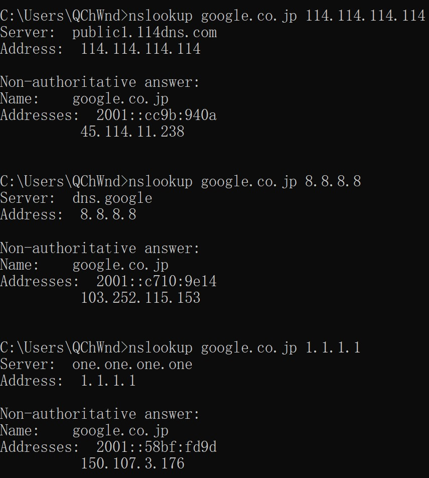

~~（牆內嘛，能對才有鬼了欸）~~

同時進行抓包（這裡用的是 Wireshark）：

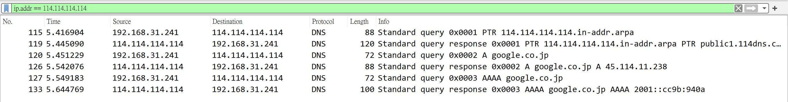（114DNS 回包的 TTL 均為 151）

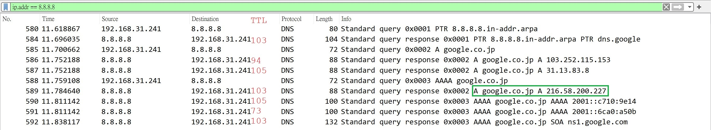

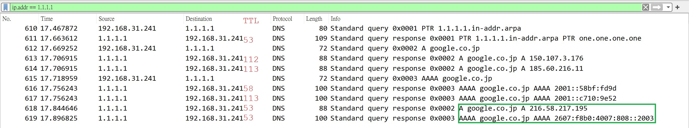

（圖中用綠色框起來的是正確的結果）

因為牆外 DNS 回包的 TTL 有很大波動，所以就 ping 一次看看是否是路由鏈路本身的問題：

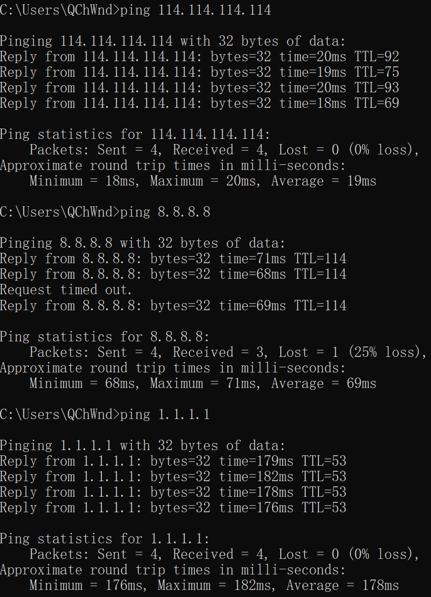

其實可以發現，114DNS 的 UDP 路由穩定而 ICMP 路由不穩定。因為這篇文章主要是探究 GFW 而不是路由，114DNS 的回覆也平凡且錯誤，所以就直接把它放著不管了。（對於一般的境內 DNS，因為遞歸性質，所以不管是快取裡面塞錯誤應答還是按規矩質詢，反正都是錯誤的）

境外 DNS 路由普遍趨向於穩定，所以排除單純因路由鏈路原因導致波動。

可以發現，正確結果的 TTL 與 DNS `0x0001` 報文的 TTL 是一樣的，而其它的結果都是來自牆的搶答。牆的搶答通常也會落在 2-3 個大區間內。其實很好理解：伺服器發包時 TTL 通常為 64 或 128，這也是收包 TTL 的主要影響因素（網際網路通常的鏈路長度在 5-15 之間）。當然牆不希望自己的發包被客戶端發現，所以應該不是固定的發包 TTL，而是在某兩個區間內各發一些包。

同時其實也可以發現牆的一個重要性質：通常不阻斷未黑洞 IP 的 UDP 包。這點也可以在 OpenVPN-UDP 已形成的連接不會被打斷（而下次連接就會把向牆外發送的握手包擋下來）上得到印證（不過本篇中不會寫到這個。下次分析 SoftetherVPN 時可能會提到吧~~，雖然估計近期寫不了~~）。

在 DoT/DoH 都早已成熟的今天，DNS 搶答其實已經可以愛管不管了~~（而且某些平臺的那些海外 HTTP API 其實也完全可以用來整 DNS 的喵）~~。

## 0x02 針對 HTTP 的 URI 與 HTTPS 的 SNI:RST 阻斷 & Hello 丟包

RST 阻斷針對的是~~樸素的~~ HTTP(S)，其原理是 HTTP 報文的 Host 字段與 HTTPS 的 TLS Hello 內的 SNI 字段。這些字段「通常」是目標網站的域名。這種方案相比某些人整天叫囂的牆 IP 來說，能應付目標網站使用公用 cdn 的情況而不影響其它網站，又能解決 DNS 汙染能被 DoH 或本地 Hosts 輕鬆繞過的問題。

為什麼 RST 可以打斷 TCP 連接呢？這其實與 TCP 的「狀態」有關。

TCP 開始傳輸真正的 Data（比如 HTTP 內容）之前，若不使用 TFO (TCP Fast Open)，則需要三次握手，即：

Client -- SYN（同步）-> Server

Client <- SYN + ACK -- Server

Client -- ACK（確認）-> Server

TCP結束傳輸前，一般會有四次握手，即：

A -- FIN -> B

A <- ACK -- B

A <- FIN -- B

A -- ACK -> B

當然，今天的 TCP 一般給第一個 FIN 也打上 ACK（沒啥意義，不過反正沒啥影響，所以一些 TCP 的實現裡喜歡把除 SYN 握手包外的所有包都打上 ACK 標籤），把 B 給 A 的 ACK 與 FIN 封裝在同一包內。這樣四次握手也變成了三次。

當連接的某一端希望立即斷開連接，則會用 RST 強行斷開連接（也有奇怪的客戶端總是用 RST 斷開連接）。當然如果向一個沒有開放的連接埠發送任何 TCP 報文，或是在未建立連接前發送非握手包，也會返回 RST（或不予理會）。

SYN、ACK、FIN 都是 TCP 報頭第 14 Byte 中佔位 1 bit 的標識符。此 Byte 有 CWR、ECE、URG、ACK、PSH、RST、SYN、FIN 八個標識符。

這裡就用~~著名「反華」媒體~~ rfi（法國國際廣播電臺）官網 `rfi.fr` 做實驗。Windows 下跑 curl 有點麻煩，我就用 packetsender 這種暴力的東西了。

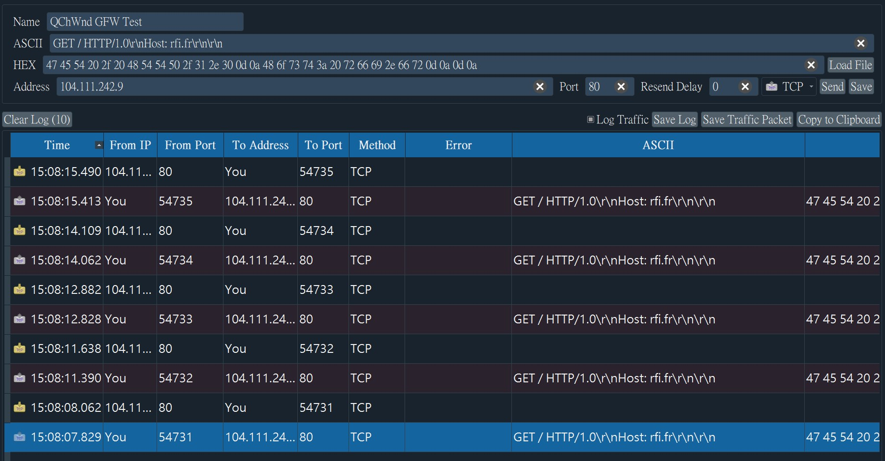

（~~這個奇怪的工具的~~時間軸是從下往上的，而且那個改方向的按鈕純屬擺設）

看上去好像沒有問題~~（更加說明工具的弱智）~~，所以還是抓包。

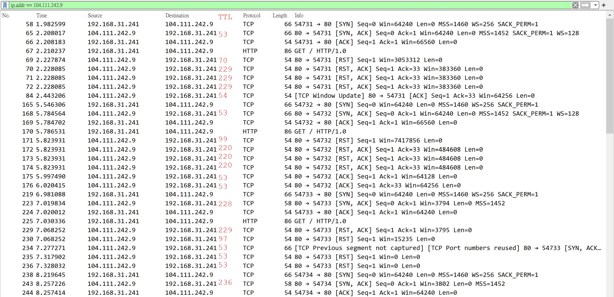


發現被RST了，而且TTL抖動也很嚴重。按慣例就是ping一發。

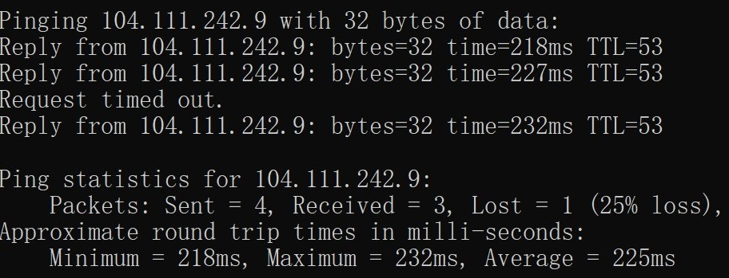

TTL 跟 53 差得遠的包大概率都是偽造的。看來 RST 都是牆整的活了。按照前輩佬們雙邊抓包的資料可知這個 RST 是雙向的。（我就懶得整這些了。發 RST 而不丟包的應該是 GFW 那些老舊的程式做的事，不過看起來 GFW 也沒打算換掉它們）

事實上，在其它實驗中發現，GFW 對明文 HTTP 的 URI 是有檢查的。在 HTTP 的 URI 中（換句話，比如域名及路徑）出現關鍵詞，就會被 RST 三連，但並不會導致封鎖。

我本來想繼續用這個工具整 HTTPS，結果發現這工具真的過於廢物了 XD

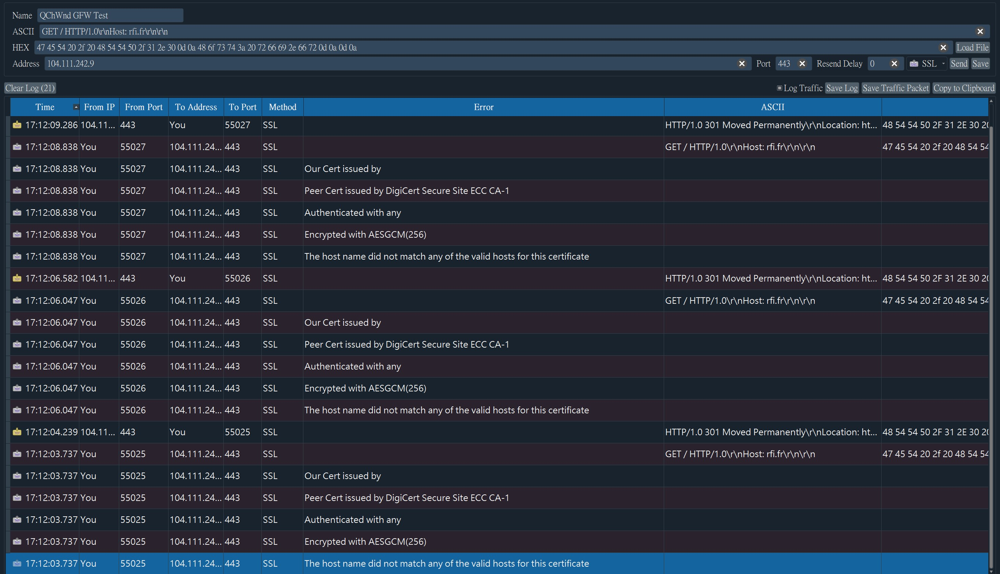

所以就乾脆改完 Hosts 用 IE 模擬。~~（突然想到，改了Hosts的話，用發包器是不是就能發了呢？鬼知道，算了）~~。

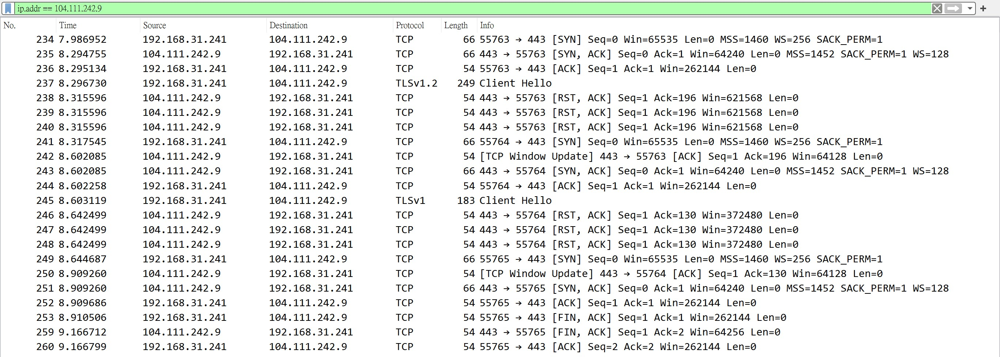

沒啥新鮮的東西，反正就是 GFW 想方設法用 RST 來打斷連接。

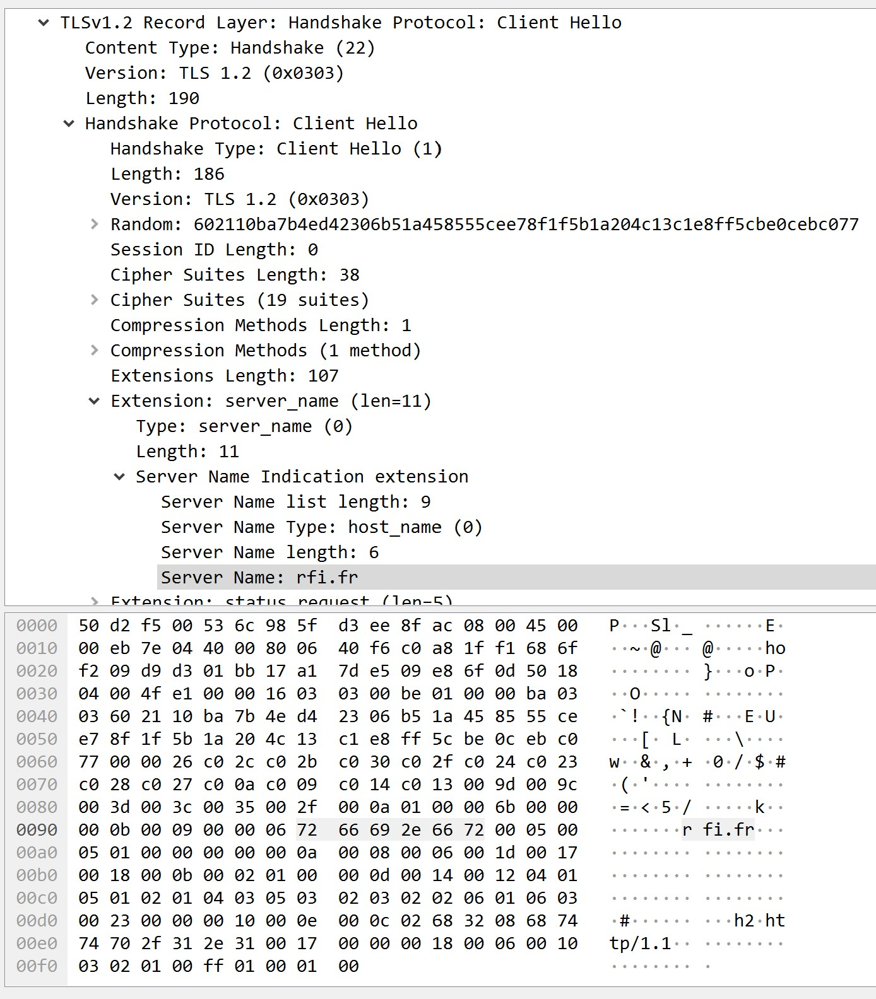

## 0x03 針對 Google/Facebook/Twitter/VPN/Proxy：IP/連接埠封鎖

這是最暴力的一種方式，一般只用來針對 Google、Facebook、Twitter 自用的IP。這裡以 Facebook 為例。

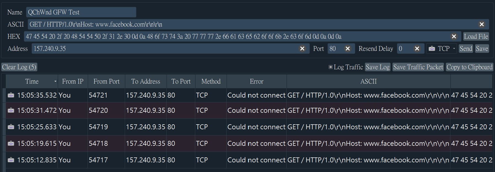

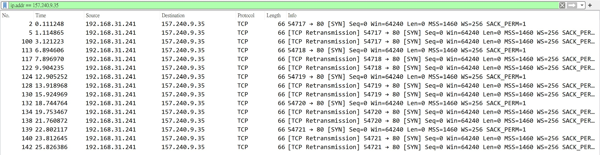

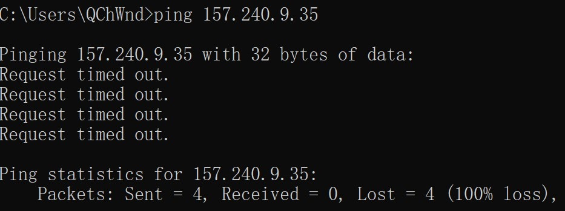

可以看出這個 Facebook 的 IP 完全被阻斷了。一般牆不使用這種暴力而不通用的方式。根據去年的測試，對於常用於翻牆的代理/VPN協定（如 Shadowsocks），牆會先封鎖提供代理服務的 IP 的此連接埠，若發現此 IP 其它連接埠也有同樣的行為則封鎖 IP。自動封鎖的 IP 一般在不再檢測到代理後一個月內解除封鎖。（我們後續的實驗發現不同原因觸發的 IP 封鎖規則的方向也是不同的）

## 0x04 TCP 路由劫持

這種方式在去年 3 月 26 日-27 日對 GitHub 的封鎖中首次出現，在今年 2 月 6 日-2 月 7 日對 CloudFlare 官網的封鎖中再次出現。表現大致是牆部署一台用於劫持特定 IP 特定連接埠的伺服器。個人認為這兩次事件只是牆的測試。~~也可能只是 GFW 團隊在玩啦。反正造成不了啥損失（~~

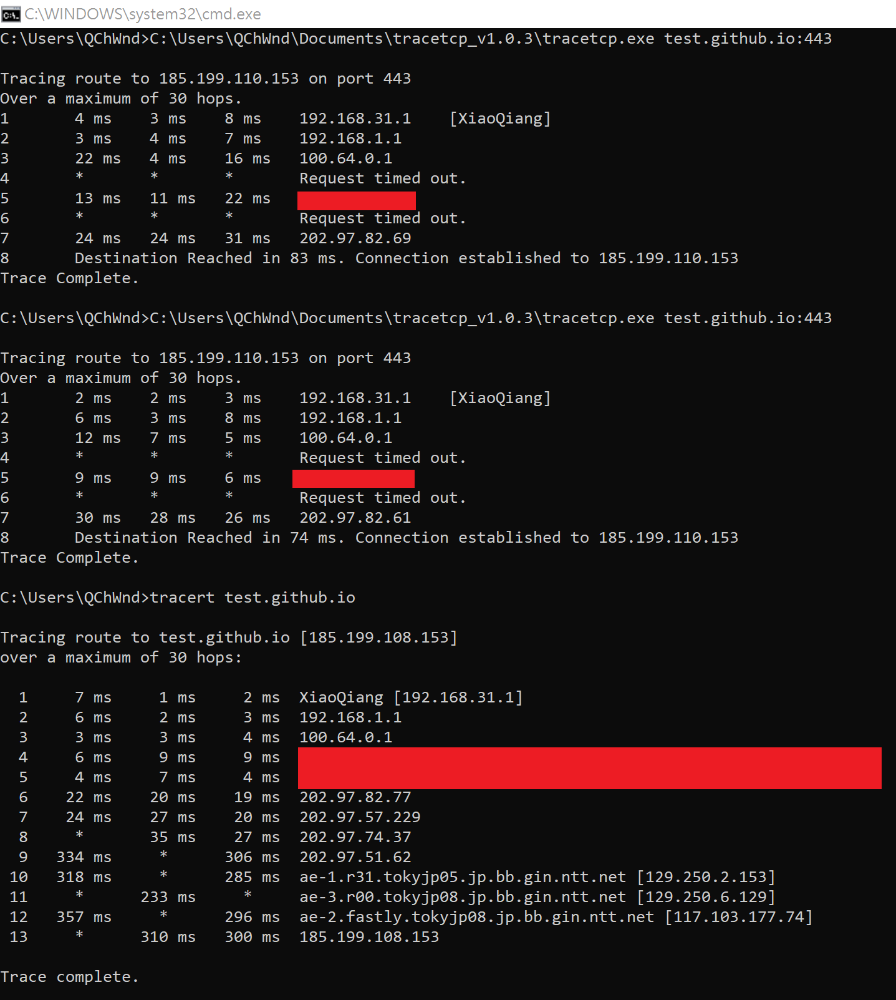

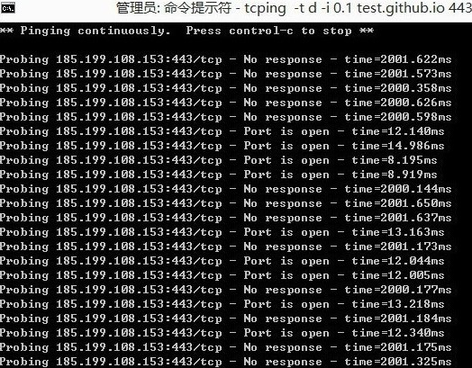

（這兩張圖是我從以前的 GitHub Pages 做的部落格上拿下來用的。當時那篇文章寫得真差勁，我想可能真的還不如只貼兩張~~破~~圖上去自己體會）

可以看出對 GitHub 的這次劫持僅針對 TCP 的 443 連接埠，而不是普通的路由劫持（我個人認為這樣可以防 DDoS）。丟包率挺高，原因未知（個人並不認為 GFW 技術不成熟）。劫持發生在出口路由上，所以可以判定是牆。

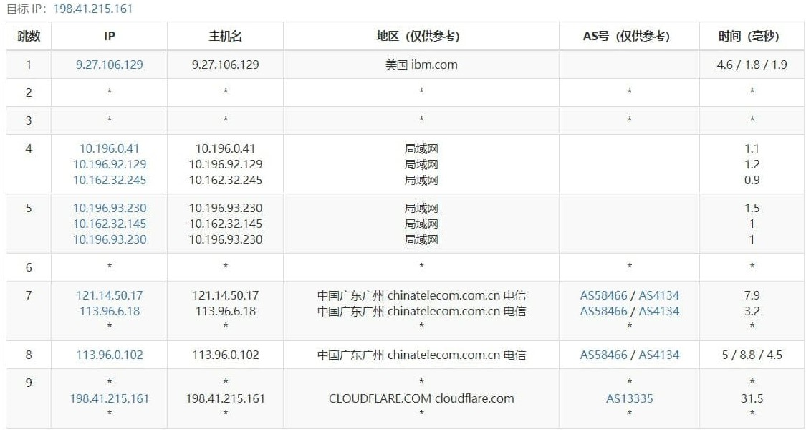

（本地路由器用 IBM 的 IP 是騰訊~~良心~~雲的特色，用美國國防部的 IP 是阿里~~黑心~~雲的特色~~。一定程度上可以讓路由器不被攻擊，這樣被打了就全是相關用戶背鍋，而且還省了一個公網 IP，多好~~）

因為是 TCP 的 80 連接埠，所以有很多公開的工具用於測試。從這張圖來看，我覺得劫持的丟包率還是很高~~（難道是要偽造你國電信出牆劣化嚴重嘛）~~。

目前不知道這種方式所針對的對象。~~或許真的只是滿玩一玩？~~我個人認為如果被劫持到的伺服器反代相關網站且部署合法的數位簽章（或者要求所有大陸設備都安裝某個數位認證），就可以神不知鬼不覺地劫持 TLS 流量。

文章到了這裡，已經講完了 GFW 日常的實現方式。我想了想，決定嘗試一下牆在十幾年前的「HTTP 關鍵詞審查」在今天會怎樣。

## 0x05 HTTP 明文內容審查：沒有審查

沒辦法，這只能自建一個 HTTP 伺服器了。所以我就用自己~~很爛~~的 HTTP 與 php 功底，寫了個~~迫真~~測試網站。

index.html

```html
<html><head><meta charset="utf-8">
<title>QChWnd GFW Test</title>
</head><body>
<form action="gfw.php" method="post">
<input type="text" name="gfw">
<input type="submit" value="Submit">
</form></body></html>
```

gfw.php

```php
<?php echo $_POST["gfw"]; ?>
```

效果差不多是這樣：（~~因為沒錢，~~我並沒有購買域名 `qch233.io`，只是透過修改 Hosts 實現）~~（反正只是測試，簡陋點又無所謂）~~

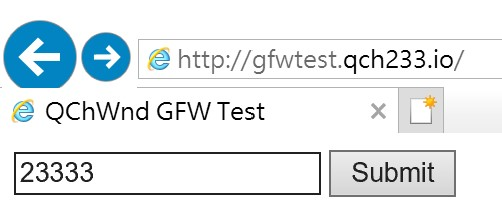

輸入的東西也會原樣返回：

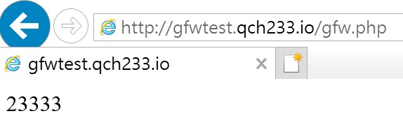

我找了找中文維基，最後選擇把 1989 年某次事件的條目的文字部分全部整下來（特意選擇「大陸簡體」），去掉換行和空格，post 了上去。

整個傳輸從頭到尾，「渾然天成」，沒有受一絲干擾。~~我感覺挺不可思議，~~又 post 兩次，也沒有被阻斷。

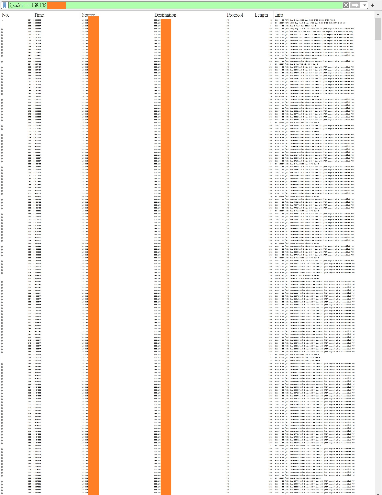

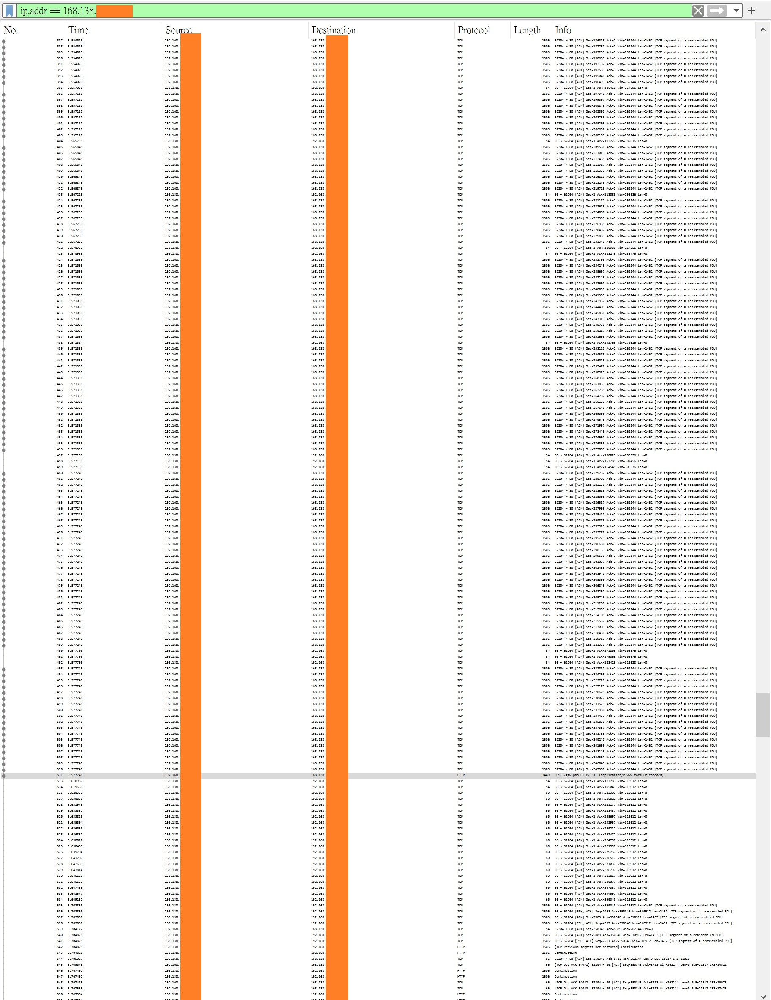

（「PSH(Push)」標識符指的是希望四層儘快將資料交給七層）

（RDP 可以自由地讓分辨率「豎起來」，可惜截圖質量還是太低欸。下次有空再弄個滾動截圖工具）

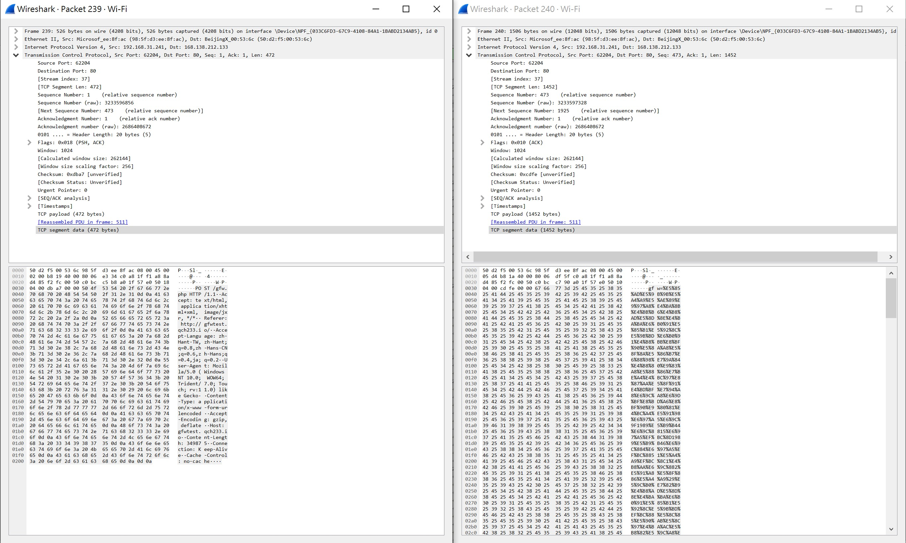

比對了瀏覽器上的文字長度與發出的長度，是一樣的。這些很有問題的這些流量就很正常地發出去，又很正常地回來了。

~~我感覺挺好。~~為了驗證牆確實已經不再審查關鍵詞，我就把整個頁面的 HTML 上傳到伺服器，用 get 試一下。這次就用中文維基的「法輪功」條目（也是先切到大陸簡體）。

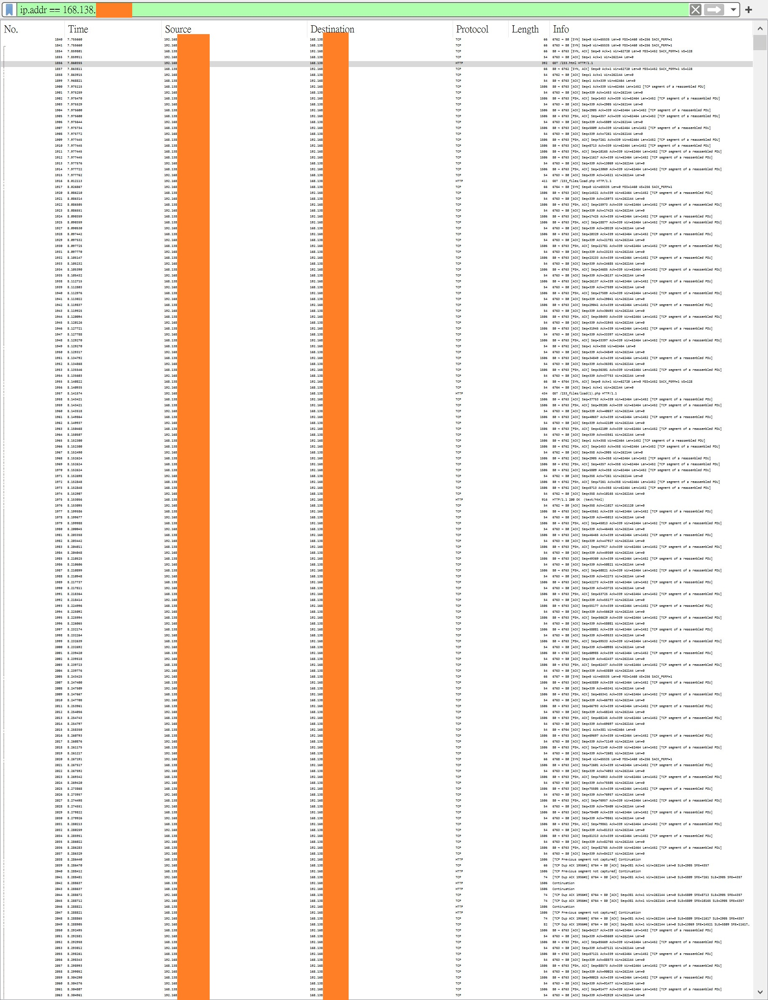

頁面和抓包依舊是都沒有任何問題。

因此斷定：GFW 已經不做 HTTP 內容審查了，2010 年的 [Empirical Study of a National-Scale Distributed Intrusion Detection System: Backbone-Level Filtering of HTML Responses in China](https://www.cs.unm.edu/~crandall/icdcs2010.pdf) 也提到這個結論。事實上，全文的 KMP 或是 Sunday 算法的匹配都是很浪費算力的；AC 自動機也一樣。當然我們看到方校長的論文提到了各種有限優化。在公用國際出口已經接近 10 Tbps，且 HTTPS 大規模應用的今天，這樣的審查成本過高、作用過小。

本文到這裡就結束了。當然這次實驗研究是不完美的：因為所有的抓包都是客戶端單方面的抓包，而沒有雙邊抓包。這樣的研究方式難以研究 GFW 針對隧道/VPN/代理類協定的封鎖。~~如果不咕，下次會想辦法分析一下 SoftetherVPN 的封鎖情況QwQ~~

明天是除夕，祝大家新年快樂！