# 建黨百年隨筆：GFW 雜談

今天是 2021 年 7 月 1 日。

GFW 是 21 世紀最強大的網際網路防火牆，我向方濱興院士及 GFW 設計團隊致以崇高敬意。

從 [Insertion, Evasion, and Denial of Service: Eluding Network Intrusion Detection](https://www.cs.unc.edu/~fabian/course_papers/PtacekNewsham98.pdf) (1998)到 [Your State is Not Mine: A Closer Look at Evading Stateful Internet Censorship](http://www.cs.ucr.edu/~krish/imc17.pdf) (2017)，將近 20 年的時間悄然而逝，而從西廂計劃至 TCPioneer（現稱 Ghostcp）的工程實踐亦不斷湧現。我也向所有 GFW 研究者以及弱特徵代理程式開發者致敬。

## 0x01 TCP 握手後阻斷

在為[上次的文章]()做抓包試驗的時候，發現針對 Wikipedia 部分 DC 的封鎖既不是 IP 封鎖（握手能正常進行），又不是 RST 阻斷（根本就沒收到 RST），而是在握手後進行丟包（本地顯示出握手後大量重傳）。

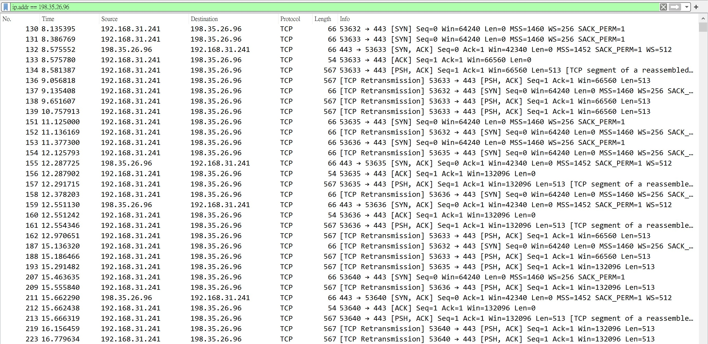

進一步試驗發現這與 Wikipedia 的 SNI 並沒有直接關係：

（下圖是後來才補上的，與抓包並非同時）

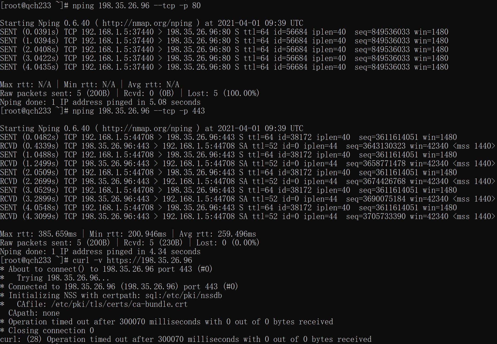


懷疑與 PSH 有關，後否定：

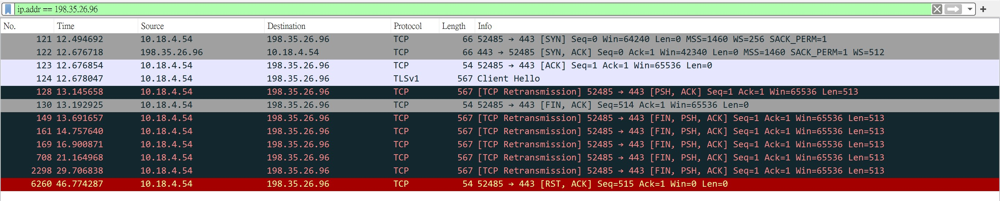

但發現隨便構造的大包卻可以透過（小包經實驗不可以，但我也沒有去試大包與小包的界限）（我還試驗了在 curl 包後補0，也不能透傳）：

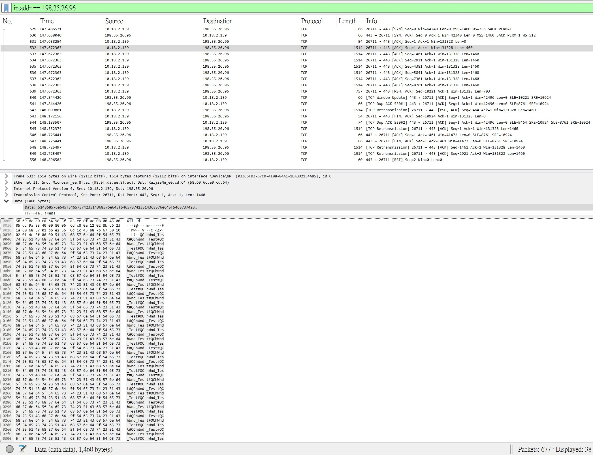

結論：僅關於 `ip.dst` 與 `tcp.port` 按包丟棄，小包除 SYN 全阻斷，大包阻斷似乎與內容有關，但與 SNI 無關。

就目前來說，感覺研究此類封鎖的研究價值不大，就暫時沒有深入做測試。

## 0x02 連接劣化

這是我試圖分析 GitHub 連接劣化時意外的發現。需要注意的是，此封鎖僅針對 GitHub 使用的部分 IP。

已知受干擾的IP：`13.250.177.223`, `13.229.188.59`, `52.74.223.119`

干擾可能阻止 TCP 握手，亦可能阻止 TLS 握手後的傳輸。當然，也有概率不被干擾。

TCP 握手時阻擋：

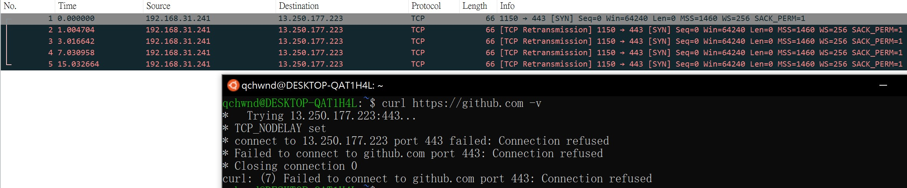

TLS 握手後阻擋：

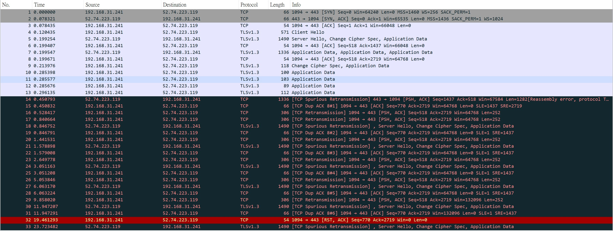

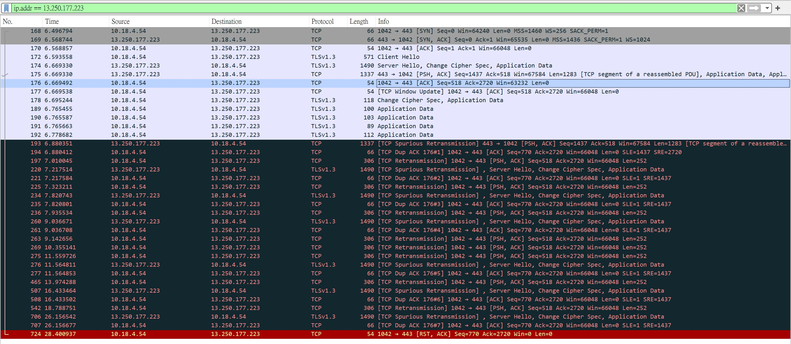

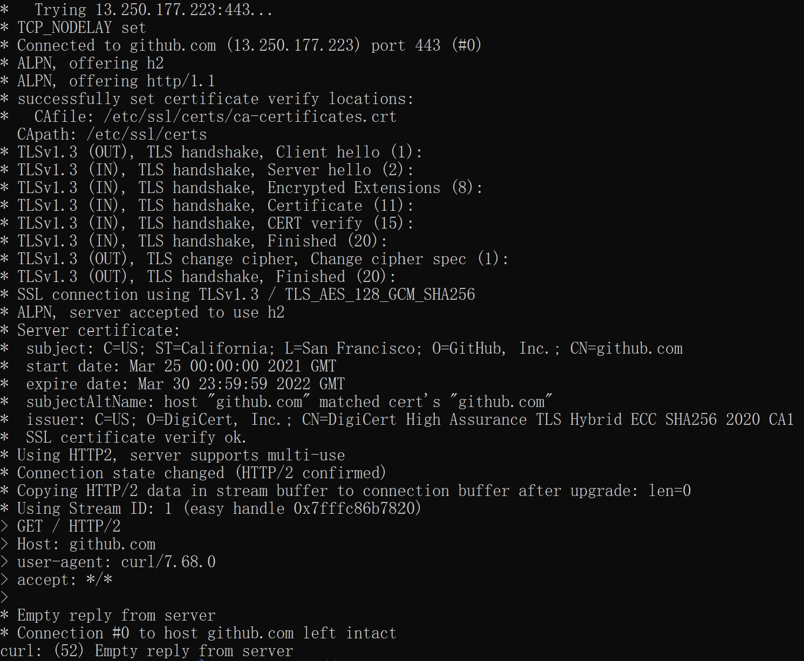

可以發現，其實干擾方式與解析出的 IP 並沒有直接關聯，但是否劣化的判定標準應該是 IP（出於握手前干擾的可行性）。

據說連接劣化在 Google 被牆前曾對 Google 部署過。

（順帶一提，解析至新加坡 AWS 可不能怪 ISP 或者 GFW，那是 GitHub 基於地區的DNS解析策略，香港的解析也一樣，不過臺灣好像更傾向於解析到日本 AWS，如 `13.114.40.48`）

（但汙染 `raw.githubusercontent.com` 到 `127.0.0.1` 或是直接不給解析怎麼想都感覺跟ISP脫不開關係：**直接解析都沒有問題**，商業 DNS 的解析也沒有問題）

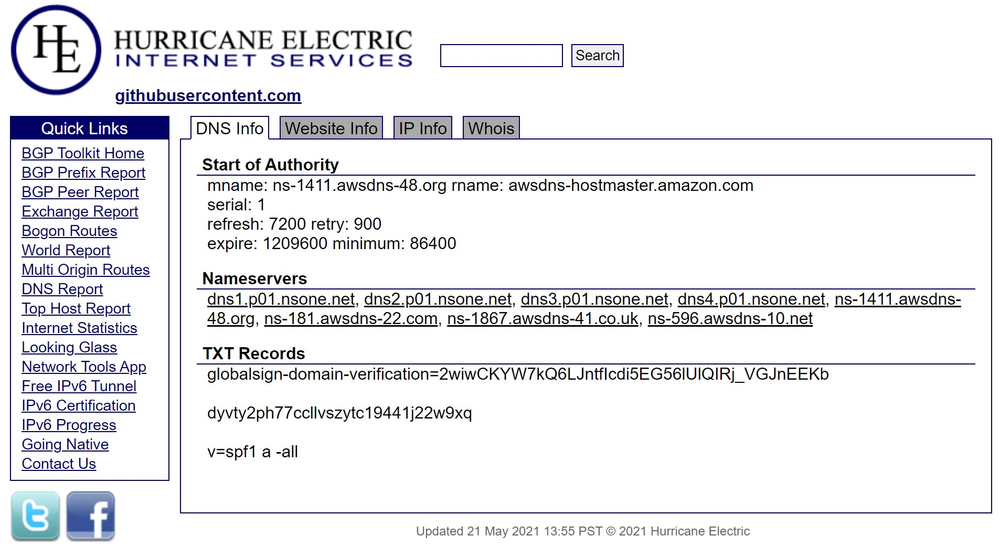

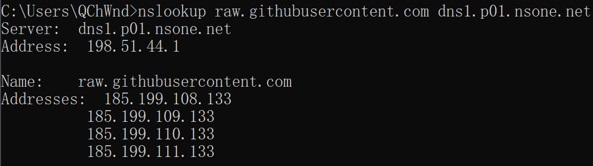

## 0x03 臨時黑洞

臨時黑洞是相對長期黑洞（如部分 Google、Facebook 等的 IP）而言的。通常被黑洞的有 OpenVPN UDP 等，不太通常且封鎖行為不穩定的如在 6in4 隧道中檢測出被封鎖網站的SNI。封鎖時長為幾分鐘。**黑洞並非檢測到包即觸發黑洞，而是在檢測到包後的數秒內才實施完全黑洞。**

相比之下，針對可檢測 Shadowsocks(R) 的黑洞時長在幾小時至幾天，在特殊時期則為封鎖至時期結束。

這是一種很古老但是通常被忽略的封鎖方式。由於目前高牆期間 GFW 會主動抓取 VPNGate 的公開 VPN，在此就不做抓包了。

## 0x04 GFW 架構分析

前置內容（摘自[深入理解GFW：内部结构](http://gfwrev.blogspot.com/2010/02/gfw.html)）

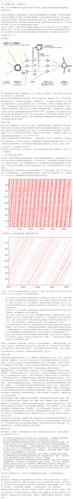

今天 Arm 架構晶片已經大量應用於分佈式架構的網路設備了，中國大陸網際出口也突破了 10 Tbps，GFW 也擁有了四層劫持（2020 年 3 月 26 日-27 日針對 GitHub TCP port 443 的劫持）與重放攻擊主動探測（見[Shadowsocks是如何被检测和封锁的](https://gfw.report/publications/imc20/data/paper/shadowsocks.pdf)），還部署了連接重組。因此我將 GFW 理解為四個部分：出口集群路由器、旁路狀態防火牆集群、劫持設施、主動探測設施。當然後三者的硬體設備未必有差異，甚至有可能是軟體定義。分成部分主要是因為它們間應該性能獨立，至少路由器與後三者間獨立。

對於長期的 IP 封鎖，出口集群路由器直接配上空路由即可（或操作 ACL，實際上由於 ACL 鏈式處理結構效率低下而並不使用 ACL）。

對於 DNS 汙染，旁路狀態防火牆收到 DNS 請求包後若發現請求的域是需要汙染的域（或子域）則搶答。

對於 RST 阻斷，旁路狀態防火牆收到包後記錄 TCP 連接狀態**（含連接重組）**、辨別協定、對**首報文**進行關鍵詞審查，偽造 IP 發送 RST。

對於臨時黑洞，旁路狀態防火牆收到包後分析狀態（如試圖帶入 OpenVPN 狀態機），確認後進行一定時間的路由牽引（或其它手段）。

對於主動探測，旁路狀態防火牆發現未知協定後將**重組後的（目前為首報文）**內容發送到主動探測設施，透過重放等方式（長期）探測。

因此若想試圖繞過 RST 阻斷或主動探測，可以試圖使旁路狀態防火牆的狀態判定錯誤。

GFW的策略是：檢測到 **TCP 握手完成後**，分配記憶體開始 TCP 流重組，當且僅當檢測到**首報文**存在關鍵詞時採取動作。

首先理解一下為什麼需要 TCP 流重組。當應用層傳給 TCP 的報文長度大於 MSS，TCP 就會將報文分段；當傳輸層(如 TCP)傳下的報文段長度大於 MTU，IP 就會將報文段分片封包。通常設定 `MSS=MTU-TCP 報頭長度-IPv4 報頭長度`。若以包或報文段為單位進行關鍵詞檢測，當關鍵詞被封到不同的包或報文段，檢測就無效。

接下來是繞過GFW的原理。TCP 存在 Checksum、TCP md5（雖被廢棄但 Linux 內核仍支援）與[TCP-AO](https://datatracker.ietf.org/doc/html/rfc5925)等機制，以及還存在 IP 的 TTL 機制能使報文段/包無效，而 GFW 的包重組並沒有完全適配 rfc。當然除此之外還有欺騙狀態的三重 SYN、利用 GFW 流重組特性的 4 Bytes 分割（詳見 [Come as You Are: Helping Unmodified Clients Bypass Censorship with Server-side Evasion](https://geneva.cs.umd.edu/papers/come-as-you-are.pdf)）等策略（詳見 [Your State is Not Mine: A Closer Look at Evading Stateful Internet Censorship](http://www.cs.ucr.edu/~krish/imc17.pdf)、[Geneva/strategies](https://github.com/Kkevsterrr/geneva/blob/master/strategies.md)）。

下圖為使用 TCPioneer method=w-md5,https,mode2 繞過GFW直連訪問 `wikipedia.org`（Firefox）：

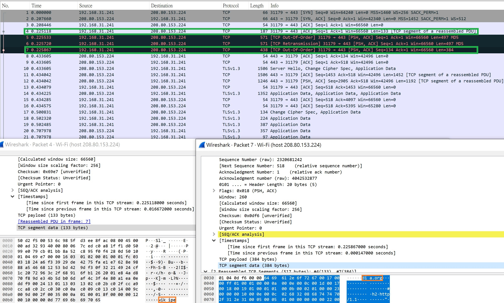

（出現 `TCP Out-Of-Order` 是因為連續包間 `Sequence Number` 混亂，被伺服器收到則會以 `Sequence Number` 順序執行亂序重組再交給應用層）

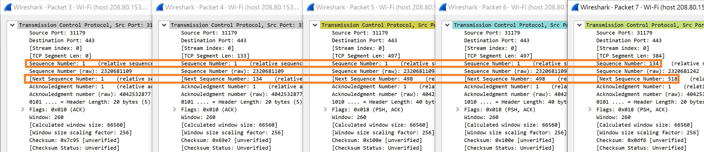

其實，當伺服器支援 TFO，由於 GFW 在 TCP 握手後才進行流重組以及後續的關鍵詞檢查，使用 TFO 即直接繞過了流重組與關鍵詞檢查。

然後可以再想想，如此顯然的漏洞，為什麼 GFW 至今沒有修正。

對 Checksum、TCP md5、TCP-AO，鑑定報文段合法性顯然加大了性能負擔。當然對於這些以及 TTL，GFW 可以選擇等到收到 ACK 再試圖重組，但這會使鑑定滯後於發回。並且由於旁路性質，也不可以修改包 TTL。

根據返回 ACK 重組呢？由於返回 ACK 無法反映具體原包是哪個同 ACK 包（也可稱重傳包），枚舉所有情況顯然要耗費大量記憶體，這也使極致優化的字串自匹配算法（如[Insunday](https://ieeexplore.ieee.org/document/8950844)）性能嚴重下降（因為對每種枚舉的情況都要自匹配）；若使用 AC 自動機/ KMP 自動機則需要記錄大量包尾狀態指針。**這些若實現，便為 DDoS GFW 提供了可能。**

GFW 目前使用類似 AC 自動機的優化算法檢查關鍵詞。Sunday 等算法更適應靜態字串動態少量關鍵詞。

同樣由於旁路，TFO 無法被去除或攔截，**且不經 TCP 握手就分配記憶體也為 DDoS GFW 提供可能**。

## 0x05 反向牆

這是 2020 年開始針對利用中國大陸境內伺服器隧道中轉翻牆代理的反制方案，目前已知引發封鎖的必要條件為在非標準連接埠 Listen 未經備案的 HTTP/TLS 且有用戶連接（因此對於「機場」等用途常用雙 IP 繞過此機制），已知**僅存在海外源發起的 TCP 連接不會導致封鎖**、封鎖與流量大小基本無關、**在對海外連接數長期很多的情況下似乎不會觸發封鎖**。**觸發封鎖時，已建立的 TCP 連接不會受到影響**，但自封鎖起，TCP、UDP、ICMP 均被封鎖。但部分包為單向封鎖（TCP ACK/PSH+ACK，ICMP），部分為雙向（UDP，TCP SYN 等）。

以下圖左為中國大陸，右圖為香港：

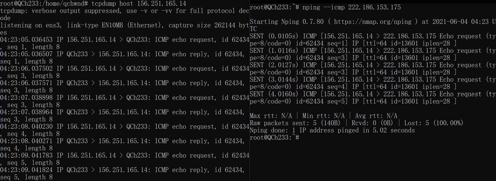

以下圖為中國大陸對香港的 mtr：

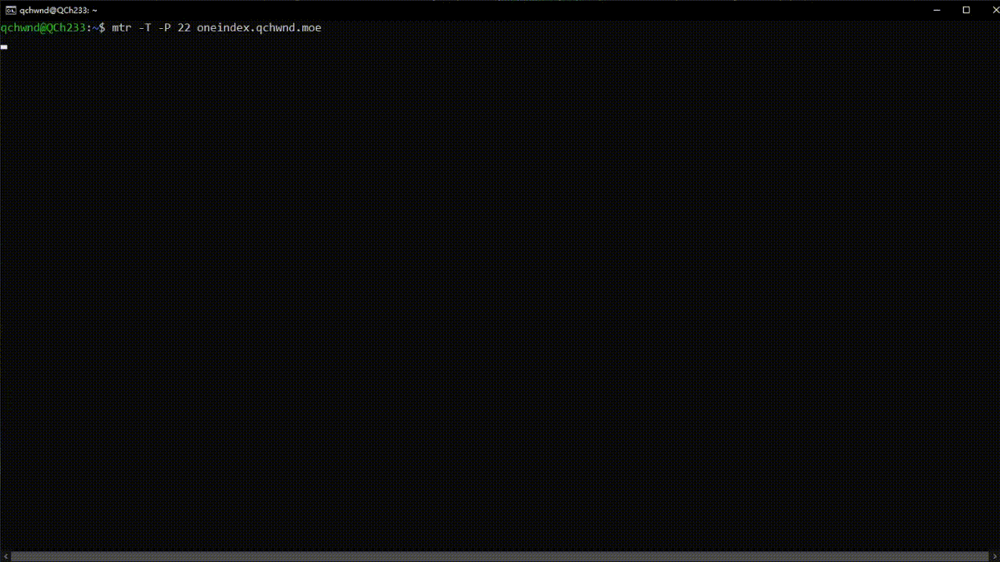

以下圖為香港對中國大陸的 mtr：

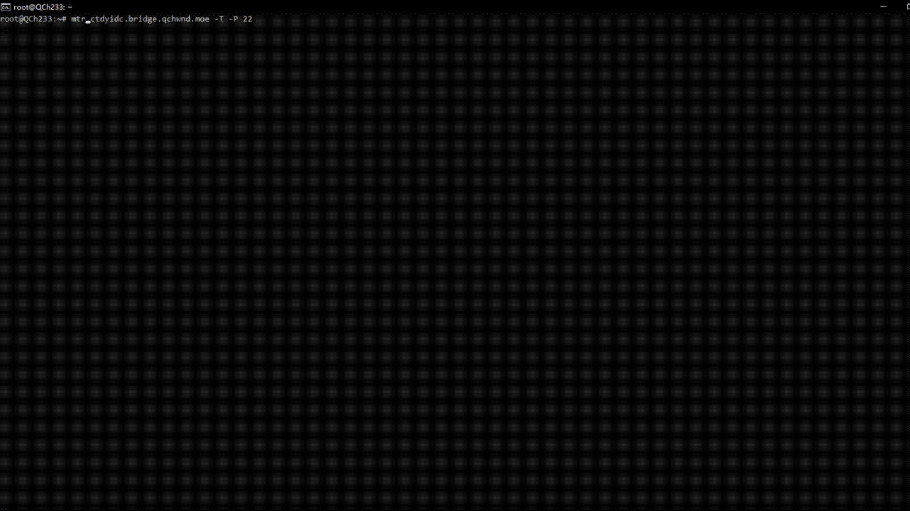

對比路由路徑，反向牆似乎是中國大陸對香港 mtr 中丟包率非常高的第 6 跳，根據 IP 可知其部署於省內。或是部署於香港對中國大陸 mtr 的第 12 跳也可能，若如此則反向牆部署於中國大陸的網際出口。

目前很奇怪的是：海外向中國大陸的 ICMP Traceroute 與 SYN Traceroute 一致，這點與部分包單向封鎖不一致，也難以解釋為何已建立的 TCP 連接不受影響。後來我做了測試，海外向中國大陸 ICMP 包的 TTL 是正常的，且 ICMP Traceroute 包也能正常接受、TTL 也正常，即排除將 TTL 改大的情況。

因為 ICMP 逾時封包有包含原包三層頭及 8 Bytes 的原包資料，個人猜測單向封鎖的實現方式含關鍵詞審查。TCP 連接不受影響則是四層狀態防火牆的一般設計。

```
ICMP 逾時封包結構
+-----------+------+----------+-----------+-----------+---------------+
| Type = 11 | Code | Checksum | Router IP | IP header | Original Data |
+-----------+------+----------+-----------+-----------+---------------+
|     1     |   1  |     2    |     8     |   Fixed   |       8       |
+-----------+------+----------+-----------+-----------+---------------+
```

## 0x06 Future

（因為時間緊張，這篇 Blog 寫得很冰冷，算法也暫時沒有做時空複雜度分析，我自己也沒看完引用的論文，rfc 以及相應的 Linux Kernel 實現，專業性很差，在此感到抱歉）

解決反向牆，根本在於直連翻牆或建立中國大陸境內網狀負載覆蓋網路。當然就目前而言，對於商業化的中轉代理，相關可用的穩定方案我已在上文中明示，在此便不必多提。

而對 GFW 的架構分析也為直連翻牆或免費翻牆提供了思路，如 TCPioneer 雙棧翻牆或是 6in4+warp 等。**但目前對 GFW 的架構分析僅限於假設 GFW 不劫持部分連接做非旁路主動篩查以干擾注入式繞過思路，而相關設備似乎已經部署完畢。**

對於代理翻牆，udp2raw 等雙邊加速思路以及可透過 CDN 的 WebSocket 代理事實上也給 GFW 帶來不少麻煩。商業性翻牆軟體也可以參考 Tor 的 [Snowflake](https://snowflake.torproject.org/) 的思路設計以防止汙染（但如今 Tor obfs 網橋的效果很差），不過 CloudFlare 已禁用了域前置。

QUIC 也為節省代理流量提供了思路。其實在 DoH、QUIC、ECH 均普及後，GFW 所能做的或許就僅限於封鎖 IP 了。但以 GFW 的科研實力，GFW 應該也可以找到折中的處理方案（DoH 存在「先有雞還是先有蛋」的屏蔽隱患，QUIC 基於 UDP 而 QoS 嚴重，ECH 的 TLS 握手包較大），具體便不得而知了。

GFW 似乎也部署了機器學習（至少方濱興早已開始了[相關研究](https://kns.cnki.net/kcms/detail/detail.aspx?dbcode=CJFD&dbname=CJFD2007&filename=JSJX200708033&v=zP0aD1FIt1rlOvIZNLyDbFblX5NlNiRD%25mmd2FJWdy%25mmd2FuYCJWiZMEX15h%25mmd2B5Pw6OJabJUXy)），具體而言，反向牆可能與機器學習的流特徵判定有關。但目前機器學習確實很難區分個人直連網站與使用 [naiveproxy](https://github.com/klzgrad/naiveproxy)。