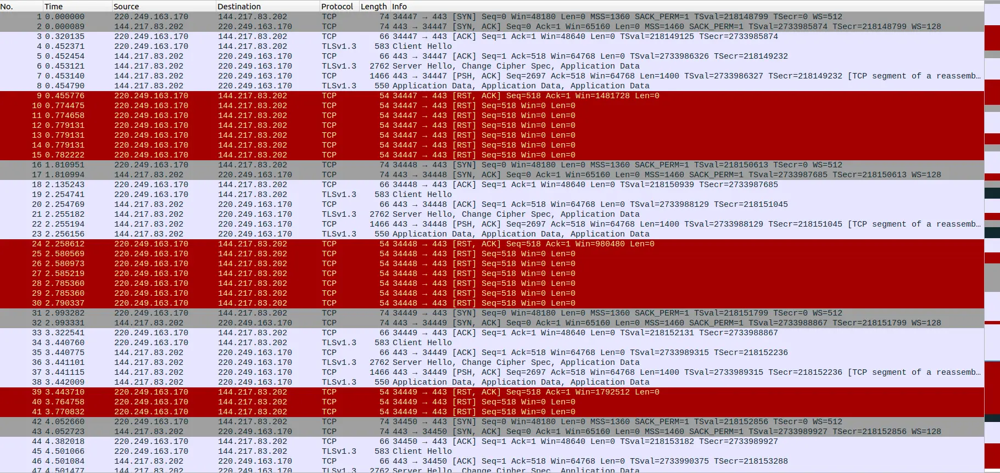

# 2023年新春隨筆：初探「省牆」

「省牆」這個名詞在 2022 年開始被反覆提到。自 Shadowsocks AEAD 可被牆至 Trojan 可被牆以來，各類有關省牆及其作用的流言頻傳。本文中認為「牆」是具有封鎖作用而非僅分析作用的設施。

本文發現的背景是發現部分網站在 [Blocky](https://blocky.greatfire.org) 上的探測結果「矛盾」。


在此站點用戶上報的少量試驗資料中發現，福建電信連接無礙而福建聯通出現 RST 阻斷。下圖為出現阻斷的抓包。


（此圖實際測試時間在 0x02 時。置此僅作示意）

## 0x01 位置證明

~~與 GFW 的「`RST+ACK` 三連」相比，每個請求只收到一次 RST+ACK 就很令人在意了 XD~~

由於從握手至受阻斷的 Client Hello 間，只有 Client Hello 的 Flags 為 `PSH+ACK`，因此可以直接使用 iptables 區分。

```
iptables -t mangle -F
iptables -t mangle -A OUTPUT -p tcp -m tcp --tcp-flags SYN,ACK,FIN,RST,URG,PSH PSH,ACK -j TTL --ttl-set 4
curl https://panel.alink345.com --max-time 5
iptables -t mangle -F
iptables -t mangle -A OUTPUT -p tcp -m tcp --tcp-flags SYN,ACK,FIN,RST,URG,PSH PSH,ACK -j TTL --ttl-set 5
curl https://panel.alink345.com --max-time 5
iptables -t mangle -F
iptables -t mangle -A OUTPUT -p tcp -m tcp --tcp-flags SYN,ACK,FIN,RST,URG,PSH PSH,ACK -j TTL --ttl-set 6
curl https://panel.alink345.com --max-time 5
iptables -t mangle -F
iptables -t mangle -A OUTPUT -p tcp -m tcp --tcp-flags SYN,ACK,FIN,RST,URG,PSH PSH,ACK -j TTL --ttl-set 7
curl https://panel.alink345.com --max-time 5
iptables -t mangle -F
```

並寫死單一域名解析以便抓包。

`104.21.39.137	panel.alink345.com`

這樣便可從耗盡 TTL 的 ICMP 返回包看出阻斷位置對應設施的 IP。


查詢發現 No.39 對應 IP 並未出省。

## 0x02 特性測試

由於此網站（在 0x01 及此項測試時）使用 CloudFlare CDN，大部分服務間同步兼容。因此，本部分測試如下。（抓包略）

測試 1：寫死解析 `104.21.39.137	cloudflare.com` 並測試 `cloudflare.com` 是否阻斷。

結果 1：不阻斷

測試 2：寫死解析 `1.1.1.1   panel.alink345.com` 並測試 `panel.alink345.com` 是否阻斷。

結果 2：不阻斷

因此可以認為阻斷的前提條件為：SNI 符合域名，且 IP 符合解析。但引來突發奇想：此「省牆」是否僅針對 CloudFlare IP 或可否透過更改 DNS 解析來繞過「省牆」？

當然是不行。因此才有了開頭的圖片：


且可從 Server 端抓包：



Server 可以接收到 Client Hello 說明干擾方式僅為旁路 `RST+ACK`。查看干擾包 TTL 發現幾乎隨機且均較大。

（註：圖中不帶 `ACK` 的 `RST` 是收到 `RST+ACK` 干擾並斷開連接後，收到非握手報文時的正常回應）

省牆是否替代了國際 GFW 呢？當然沒有。下圖是 `curl bbc.com` 發生的超級熟悉的 GFW 阻斷。實際上類似上文的 iptables 改包測試結果也證明阻斷發生在國際出口（此處抓包略）。


並使用如下方式測試 DNS 汙染的位置，可以得知也在國際出口。

```
iptables -t mangle -F
iptables -t mangle -A OUTPUT -p udp -j TTL --ttl-set 6
dig alink123.com @8.8.4.4
iptables -t mangle -F
iptables -t mangle -A OUTPUT -p udp -j TTL --ttl-set 7
dig alink123.com @8.8.4.4
iptables -t mangle -F
iptables -t mangle -A OUTPUT -p udp -j TTL --ttl-set 8
dig alink123.com @8.8.4.4
iptables -t mangle -F
iptables -t mangle -A OUTPUT -p udp -j TTL --ttl-set 9
dig alink123.com @8.8.4.4
iptables -t mangle -F
```


因此 GFW 下放成為「省牆」的想法是錯誤的，GFW 與「省牆」獨立存在。

## 0x03 綜述與展望

本文上述試驗的目的大致只是初探「省牆」的存在以及其 `RST+ACK` 的干擾阻斷模式。除了存在之外還可以得出以下結論：

作用於在於本省省級 ISP 設施

有一定的同步機制

規則和作用均與 GFW 平行

各省各 ISP 部署不完全

本文中，「省牆」的作用為干擾式阻斷，與 GFW 相同，因而並沒有體現「省牆」的特殊作用。但從大規模的燒錢部署來看，「省牆」與 GFW 對於 CCP 來說都應是有理由需要的東西。因此可作出如下猜想：

骨幹擴容、出口擴容、封鎖域名增多等因素導致 GFW 有算力或電力缺口

「省牆」具更複雜的記錄、分析、學習能力及允許更大性能消耗的劫持、重組能力

省際間有更嚴苛的審計要求

各省有更細緻的規則區別

本文還欠缺的試驗：

有狀態/無狀態/重組狀態？頭匹配/全文匹配/協議匹配？主動探測？劫持？

若根據「牆具有封鎖作用」的定義，對於現象歸屬 GFW 或「省牆」，較通用的方式只有 TTL 方法；需要維護 TCP 狀態的防火牆整體而言一定需要一種負載均衡中的調度方案，部分設施缺陷可能導致特定元組出現漏過現象，未必是省牆。

以及關於中國大陸的法律問題：

计算机信息网络直接进行国际联网，必须使用邮电部国家公用电信网提供的国际出入口信道。任何单位和个人不得自行建立或者使用其他信道进行国际联网。（《中华人民共和国计算机信息网络国际联网管理暂行规定》第六条）

国家建立数据跨境安全网关，对来源于中华人民共和国境外、法律和行政法规禁止发布或者传输的信息予以阻断传播。任何个人和组织不得提供用于穿透、绕过数据跨境安全网关的程序、工具、线路等，不得为穿透、绕过数据跨境安全网关提供互联网接入、服务器托管、技术支持、传播推广、支付结算、应用下载等服务。（《网络数据安全管理条例（征求意见稿）》第五章 数据跨境安全管理 第四十一条）

翻越「省牆」不「跨境」，似乎不存在什麼問題。因此若目前 GFW 移至省級，則使用 [GhosTCP](https://github.com/macronut/ghostcp) 等工具，或使用此類工具開放和售賣中國境內 proxy 似乎將不違法。

近期我個人比較忙碌，~~拖稿時間長達 3 年之久了，~~接下來除了寫完 GCM 等理論篇章外，更會注重基於特徵分析的 proxy 檢測機制及有關特徵收集機制的工程算法實現。

本文感謝某~~倒大霉的~~被牆機場及熱心且具良好素質的~~（非貶義）~~測試用戶。亦感謝提供詳盡測試及資料的 [Blocky](https://blocky.greatfire.org)。